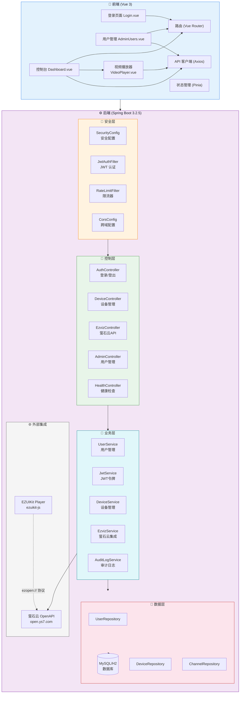

# 视频监控管理平台

基于 **萤石云开放平台** 的实时视频监控系统，支持多设备、多通道直播查看、云台控制（PTZ）、用户权限管理等功能。

## 📋 项目概览

```
实时视频监控平台
├── backend/                    # Spring Boot 后端 (Java 17)
│   └── src/main/java/com/realtimevideo/
│       ├── config/             # 安全配置、CORS、JWT过滤器、限流器
│       ├── controller/         # REST API 控制器
│       ├── dto/                # 数据传输对象
│       ├── model/              # 实体模型 (User/Device/Channel/OperationLog)
│       ├── repository/         # JPA 数据访问层
│       └── service/            # 业务逻辑层
├── frontend/                   # Vue 3 前端
│   └── src/
│       ├── api/                # Axios API 客户端
│       ├── components/         # 可复用组件 (VideoPlayer/Toast)
│       ├── composables/        # Vue 组合式函数 (useToast)
│       ├── router/             # Vue Router 路由配置
│       ├── store/              # Pinia 状态管理
│       └── views/              # 页面视图 (桌面端 + 移动端)
├── deploy/                     # Docker 部署配置
│   ├── Dockerfile.backend      # 后端容器镜像
│   ├── Dockerfile.frontend     # 前端容器镜像
│   ├── nginx.conf              # Nginx 配置（方式一用）
│   ├── bt-nginx.conf           # 宝塔面板 Nginx 模板（参考用）
│   ├── bt-nginx-full.conf      # 宝塔面板完整配置（含 BT 默认规则）
│   ├── init.sql                # 数据库初始化脚本
│   ├── build-package.sh        # 构建打包脚本
│   ├── deploy.sh               # 方式一部署脚本
│   └── deploy-bt.sh            # 方式二部署脚本（宝塔面板）
├── deploy-server.sh            # 服务器一键部署（方式一）
├── docker-compose.yml          # 方式一：三容器编排 (MySQL + Backend + Nginx)
├── docker-compose.backend-only.yml  # 方式二：仅后端 (MySQL + Backend)
└── .env.example                # 环境变量配置模板
```

## 🏗️ 系统架构图



## 🔄 数据流说明

```
用户请求流程：
1. 用户访问登录页面 → 输入用户名密码
2. 前端调用 /api/auth/login → 后端验证返回 JWT Token
3. 前端携带 Token 获取设备列表 /api/ezviz/channels
4. 前端获取萤石云 accessToken → 传递给 EZUIKit 播放器
5. EZUIKit 通过 ezopen:// 协议解析直播地址并播放视频
6. 用户可使用云台控制 (PTZ)、截图、录制、画质切换等功能
```

## ✨ 功能特性

- **🔐 用户认证** — JWT 双 Token 机制（Access + Refresh Token），refreshToken 通过 httpOnly Cookie 传输
- **🔄 强制改密** — 首次登录强制修改密码，支持 6~18 位任意字符
- **🔑 自助改密** — 桌面端、移动端均支持用户自助修改密码
- **📹 视频直播** — 基于 EZUIKit 播放器，支持萤石云设备实时查看
- **🎚️ 画质切换** — 流畅/高清/自动三档画质，自动检测网络质量
- **🎮 PTZ 云台控制** — 上下左右 + 变焦控制，支持鼠标/触控，受设备权限控制
- **📋 设备管理** — 萤石云设备自动同步，通道列表树形展示
- **👥 用户管理** — 管理员后台，支持创建/禁用/重置密码
- **🛡️ 设备权限隔离** — 普通用户只能查看已授权的设备通道，播放与 PTZ 操作均需权限校验
- **📝 操作审计日志** — 记录用户关键操作，支持分页查询与筛选
- **🔒 登录安全** — 登录失败锁定（5 次/30 分钟）、请求限流（Bucket4j 令牌桶）
- **⚡ 性能优化** — 通道列表 5 秒缓存、智能在线状态轮询刷新、骨架屏加载
- **🔄 通道状态刷新** — 所有用户均可按需刷新通道在线状态（仅更新 status，不修改配置）
- **📱 移动端适配** — 独立移动端布局，抽屉式侧边栏，横屏全屏播放
- **🌙 夜间模式** — 深色主题支持，保护夜间观看体验
- **🧪 单元测试** — 8 个后端测试用例覆盖服务逻辑与接口权限

## 🚀 快速启动

### 环境要求

- **JDK 17+**
- **Node.js 18+**
- **Maven 3.8+**
- **Docker + Docker Compose**（生产部署）

### 开发环境启动

```bash
# 1. 启动后端
cd backend
mvn clean install -DskipTests   # 跳过测试快速构建
mvn spring-boot:run
# 服务启动在 http://localhost:8080

# 2. 运行后端单元测试
mvn test

# 3. 启动前端（新开终端）
cd frontend
npm install
npm run dev
# 开发服务器启动在 http://localhost:5173
```

### 🐳 方式一：Docker 全容器部署（推荐，无需 Nginx 配置）

```bash
# 1. 编辑 .env 配置
cp .env.example .env
vi .env              # 填入 EZS_APP_KEY, EZS_APP_SECRET, JWT_SECRET

# 2. 构建并启动
docker compose down
docker compose up -d --build

# 或使用服务器一键部署脚本
bash deploy-server.sh
```

> ⚠️ **注意**：修改 `.env` 后必须 `docker compose down && docker compose up -d`，不能用 `restart`，否则不会重新读取环境变量。

### 🧩 方式二：宝塔面板部署（适合已有 BT 管理的服务器）

**架构**：BT Nginx 负责前端 + 反向代理，Docker 仅跑后端 + 数据库。

```
BT Nginx (80/443)
  ├── / → 前端静态文件（站点根目录）
  ├── /api/* → 反向代理 → backend (127.0.0.1:8081)
  └── /ezuikit_cdn/* → 反向代理 → 萤石云 CDN
```

**① 部署后端服务：**

```bash
# 上传构建包到服务器，解压到 /opt/realtime-video
cd /opt/realtime-video
cp deploy/env.production .env
# 编辑 .env 填入萤石云凭证和 JWT 密钥
vi .env
```

**⚠️ 关键：配置 CORS 允许的域名（否则登录报 403）：**

```bash
# 在 .env 中添加一行（域名换成你自己的）
echo 'CORS_ALLOWED_ORIGINS=https://realtimevideo.jgjl.cn' >> .env
```

```bash
# 启动后端（仅运行 db + backend，端口映射 127.0.0.1:8081）
docker compose -p realtime-video -f docker-compose.backend-only.yml up -d --build
```

> ⚠️ **修改 .env 后必须重建容器**：`docker compose -p realtime-video -f docker-compose.backend-only.yml down` 再 `up -d`，`restart` 不会重新读取环境变量。

**② 宝塔面板新建站点：**

```
宝塔面板 → 网站 → 添加站点
  ├── 域名：     输入你的域名
  ├── 项目类型： 选「HTML项目」
  └── 提交
```

提交后，将前端文件上传到站点根目录：

```bash
cp -r /opt/realtime-video/frontend/dist/* /www/wwwroot/你的域名/
```

**③ 配置 Nginx（关键步骤）：**

> ⚠️ **不要**用 `deploy/bt-nginx.conf` 整个替换 BT 配置，会破坏 SSL 验证。

正确做法：

```
宝塔 → 网站 → 你的域名 → 设置 → 配置文件
```

全选删除，粘贴 `deploy/bt-nginx-full.conf` 的内容（内置了 BT 默认规则 + RealTimeVideo 专用配置）。

或者手动在 BT 默认配置末尾追加：

```nginx
# ====== RealTimeVideo 配置 ======
location /api/ {
    proxy_pass http://127.0.0.1:8081;
    proxy_set_header Host $host;
    proxy_set_header X-Real-IP $remote_addr;
    proxy_set_header X-Forwarded-For $proxy_add_x_forwarded_for;
    proxy_set_header X-Forwarded-Proto $scheme;
    proxy_connect_timeout 10s;
    proxy_read_timeout 60s;
    proxy_send_timeout 60s;
}
location ~ ^/ezuikit_cdn/.*\.wasm$ {
    rewrite ^/ezuikit_cdn/(.*)$ /ezuikit_js/v9.0.5/ezuikit_static/$1 break;
    proxy_pass https://openstatic.ys7.com;
    proxy_set_header Host openstatic.ys7.com;
    proxy_ssl_server_name on;
    proxy_ssl_verify off;
    proxy_hide_header Content-Type;
    add_header Content-Type application/wasm;
}
location /ezuikit_cdn/ {
    rewrite ^/ezuikit_cdn/(.*)$ /ezuikit_js/v9.0.5/ezuikit_static/$1 break;
    proxy_pass https://openstatic.ys7.com;
    proxy_set_header Host openstatic.ys7.com;
    proxy_ssl_server_name on;
    proxy_ssl_verify off;
}
location / {
    try_files $uri $uri/ /index.html;
}
```

**④ 验证部署：**

```bash
# 检查后端是否正常
curl http://127.0.0.1:8081/api/health
# 应返回 {"code":200,"message":"success","data":{"status":"UP"}}

# 浏览器访问 https://你的域名
# 看到登录页 → 输入 admin / Admin@123456 → 登录成功
```

**⑤ 常见问题：**

| 问题 | 原因 | 解决 |
|------|------|------|
| 登录返回 403 | CORS 白名单未配置域名 | 在 `.env` 加 `CORS_ALLOWED_ORIGINS=https://你的域名` 并重建容器 |
| 页面白屏 / 404 | 前端文件未上传或路径不对 | 检查 `frontend/dist/` 是否已复制到站点根目录 |
| 视频加载失败 | EZUIKit 反代配置错误 | 检查 Nginx 配置中 `/ezuikit_cdn/` 的 location 是否正确 |
| 修改配置后无效 | `restart` 不会重读 `.env` | 必须 `down` 再 `up -d` |

**⑥ 后续加新业务：**

宝塔新建站点 → Docker 新项目（端口错开，如 8082/8083）→ BT 站点配置追加对应 proxy_pass，互不干扰。

### 默认账户

| 用户名 | 密码 | 角色 |
|--------|------|------|
| admin | Admin@123456 | 管理员 |
| user | User@123456 | 普通用户 |

> ⚠️ **安全提醒**：首次登录后请立即修改密码！

### 运行测试

```bash
cd backend
mvn test      # 运行后端单元测试
```

## 🔧 快速配置

复制环境变量模板并填写：

```bash
cp .env.example .env
# 编辑 .env 填入萤石云凭证和 JWT 密钥
```

## 📦 技术栈

| 层级 | 技术 | 版本 |
|------|------|------|
| **前端框架** | Vue 3 | ^3.4.27 |
| **构建工具** | Vite | ^5.2.12 |
| **状态管理** | Pinia | ^2.1.7 |
| **路由** | Vue Router | ^4.3.2 |
| **HTTP 客户端** | Axios | ^1.7.2 |
| **视频播放** | EZUIKit (ezuikit-js) | ^9.0.5 |
| **后端框架** | Spring Boot | 3.2.5 |
| **安全框架** | Spring Security | 3.2.5 |
| **ORM** | Spring Data JPA | 3.2.5 |
| **数据库** | MySQL 8.0 / H2 | - |
| **JWT** | JJWT | 0.12.5 |
| **限流** | Bucket4j | 8.7.0 |
| **部署** | Docker Compose | - |

## 🔧 配置说明

### 环境变量

项目使用 `.env` 文件管理敏感配置（已在 `.gitignore` 中排除）：

```bash
# 萤石云 OpenAPI 凭证（在 console.ys7.com 获取）
EZS_APP_KEY=你的萤石云appKey
EZS_APP_SECRET=你的萤石云appSecret

# JWT 签名密钥（生产环境务必修改）
# 生成命令: openssl rand -base64 32
JWT_SECRET=你的BASE64编码的随机密钥
```

### Docker 部署配置

详见 `docker-compose.yml`，三容器架构：

```
db (MySQL 8.0)  ←── backend (Spring Boot)  ←── frontend (Nginx)
  backend-net          backend-net + frontend-net     frontend-net
```

- 数据库不对外暴露端口，仅 backend 可通过 Docker 内部网络访问
- backend 同时位于 backend-net 和 frontend-net，实现跨网络通信
- Nginx 配置了运行时 DNS 解析，启动不依赖后端容器就绪状态

## 🔐 安全架构

- **JWT 双 Token**：Access Token（15分钟，localStorage）+ Refresh Token（7天，httpOnly Cookie）
- **Cookie 安全属性**：httpOnly、SameSite=Strict、Path=/api/auth
- **BCrypt 密码加密**：强度 12
- **登录失败锁定**：5 次连续失败锁定 30 分钟
- **请求限流**：通用 API 120 次/分钟，登录接口 10 次/分钟 + 30 次/小时
- **CORS 白名单**：仅允许配置的域名跨域访问
- **统一异常处理**：不暴露内部错误细节
- **设备权限隔离**：通道列表、Token 获取、PTZ 控制等所有设备相关 API 均受 `UserDevicePermission` 权限校验

## 📜 许可证

MIT License
