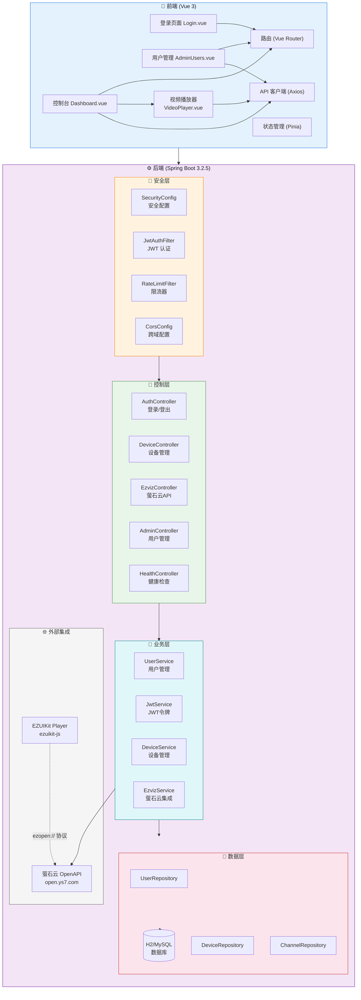

# 实时视频监控平台 (RealTimeVideo)

基于 **萤石云开放平台** 的实时视频监控系统，支持多设备、多通道直播查看、云台控制（PTZ）、用户权限管理等功能。

## 📋 项目概览

```
实时视频监控平台
├── backend/          # Spring Boot 后端 (Java 17)
│   ├── config/       # 安全配置、CORS、JWT过滤器、限流器
│   ├── controller/   # REST API 控制器
│   ├── dto/          # 数据传输对象
│   ├── model/        # 实体模型 (User/Device/Channel)
│   ├── repository/   # JPA 数据访问层
│   └── service/      # 业务逻辑层
├── frontend/         # Vue 3 前端
│   └── src/
│       ├── api/      # Axios API 客户端
│       ├── components/ # 可复用组件 (VideoPlayer)
│       ├── router/   # Vue Router 路由配置
│       ├── store/    # Pinia 状态管理
│       └── views/    # 页面视图 (Login/Dashboard/Admin)
└── README.md         # 项目文档（本文件）
```

## 🏗️ 系统架构图



## 🔄 数据流说明

```
用户请求流程：
1. 用户访问登录页面 → 输入用户名密码
2. 前端调用 /api/auth/login → 后端验证返回 JWT Token
3. 前端携带 Token 获取设备列表 /api/ezviz/channels
4. 前端获取萤石云 accessToken → 传递给 EZUIKit 播放器
5. EZUIKit 通过 ezopen:// 协议解析直播地址并播放视频
6. 解码器文件（WASM）通过 Vite 代理加载，修正 CDN 的 MIME 类型
7. 用户可使用云台控制 (PTZ)、截图、录制、画质切换等功能
```

## 🔧 已解决问题记录

### WASM 编译失败（Incorrect MIME type）
- **原因**: 萤石云 CDN 返回 `.wasm` 文件时使用 `Content-Type: application/octet-stream`，浏览器 WebAssembly 流式编译要求 `application/wasm`
- **解决**: 在 Vite 配置中添加 `/ezuikit_cdn` 代理，拦截 `.wasm` 文件响应并修正 Content-Type
- **关键配置**: `vite.config.js` 中的 `proxy` 和 `wasm-mime-type-fix` 插件

### ezopen 协议 10001 错误
- **原因**: 使用了错误的设备序列号（`ipcSerial`），萤石云直播地址 API 只识别 `deviceSerial`
- **解决**: 始终使用 `deviceSerial`（NVR 序列号）+ `channelNo`（通道号）构建播放地址
- **格式**: `ezopen://open.ys7.com/{deviceSerial}/{channelNo}.hd.live`

### SharedArrayBuffer 不可用
- **原因**: 缺少 COEP/COOP 响应头
- **解决**: 在 Vite 配置中添加 `Cross-Origin-Embedder-Policy: credentialless` 和 `Cross-Origin-Opener-Policy: same-origin`

### 视频黑边问题
- **原因**: 播放器缩放模式默认 `contain`（保持比例留黑边）
- **解决**: 设置 `scaleMode: 1`（cover 填充模式）

## ✨ 功能特性

- **🔐 用户认证** — JWT 双 Token 机制（Access + Refresh Token），自动刷新
- **📹 视频直播** — 基于 EZUIKit 播放器，支持萤石云设备实时查看
- **🎚️ 画质切换** — 流畅/高清/自动三档画质，自动检测网络质量
- **🎮 PTZ 云台控制** — 上下左右 + 变焦控制，支持鼠标/触控
- **📋 设备管理** — 萤石云设备自动同步，通道列表树形展示
- **👥 用户管理** — 管理员后台，支持创建/禁用/重置密码
- **🛡️ 安全防护** — 登录失败锁定、请求限流、JWT 黑名单机制
- **⚡ 性能优化** — 视频缓冲区自适应、网络质量检测、指数退避重连
- **🔄 状态刷新** — 定时自动刷新设备在线状态

## 🚀 快速启动

### 环境要求

- **JDK 17+**
- **Node.js 18+**
- **Maven 3.8+**

### 后端启动

```bash
cd backend
mvn clean install -DskipTests
mvn spring-boot:run
```

服务启动在 `http://localhost:8080`，H2 控制台：`http://localhost:8080/h2-console`

### 前端启动

```bash
cd frontend
npm install
npm run dev
```

开发服务器启动在 `http://localhost:5173`

### 默认账户

| 用户名 | 密码 | 角色 |
|--------|------|------|
| admin | Admin@123456 | 管理员 |
| user | User@123456 | 普通用户 |

> ⚠️ **安全提醒**：首次登录后请立即修改密码！

## 📦 技术栈

| 层级 | 技术 | 版本 |
|------|------|------|
| **前端框架** | Vue 3 | ^3.4.27 |
| **构建工具** | Vite | ^5.2.12 |
| **状态管理** | Pinia | ^2.1.7 |
| **路由** | Vue Router | ^4.3.2 |
| **HTTP 客户端** | Axios | ^1.7.2 |
| **视频播放** | EZUIKit | ^9.0.5 |
| **后端框架** | Spring Boot | 3.2.5 |
| **安全框架** | Spring Security | 3.2.5 |
| **ORM** | Spring Data JPA | 3.2.5 |
| **数据库** | H2 / MySQL | - |
| **JWT** | JJWT | 0.12.5 |
| **限流** | Bucket4j | 8.7.0 |

## 🔧 配置说明

### 萤石云配置

在 `application.yml` 中配置萤石云 API 凭证：

```yaml
ezviz:
  app-key: YOUR_APP_KEY
  app-secret: YOUR_APP_SECRET
```

### 生产部署

使用 `--spring.profiles.active=prod` 激活生产配置：

```bash
java -jar backend/target/realtime-video-backend-1.0.0.jar --spring.profiles.active=prod
```

生产环境需要配置：
- MySQL 数据库连接
- 强随机 JWT 密钥（`openssl rand -base64 32`）
- 允许的 CORS 域名

## 📜 许可证

MIT License
